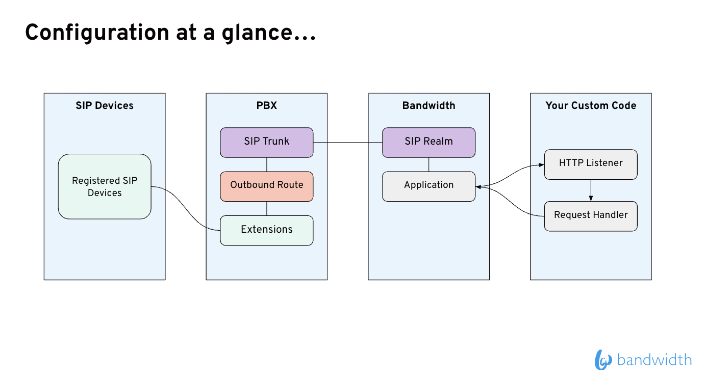
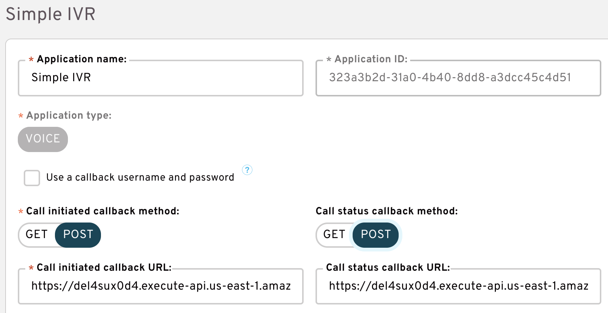
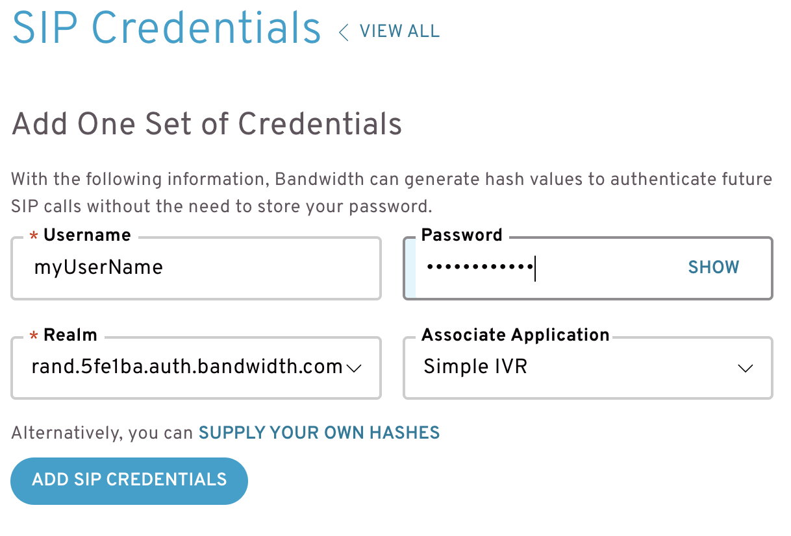
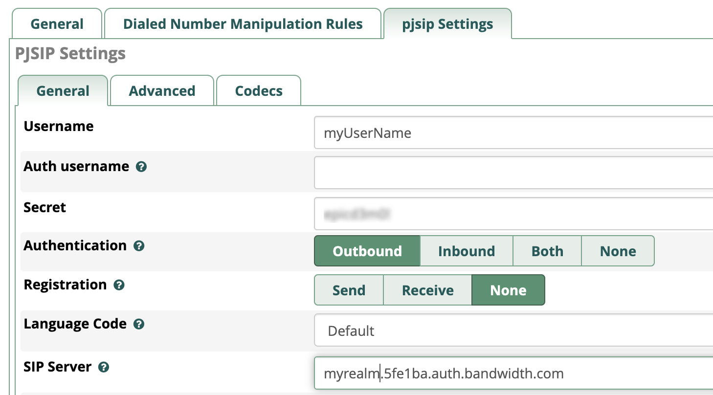
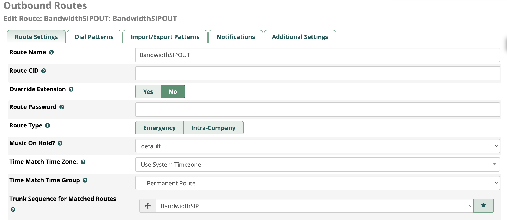
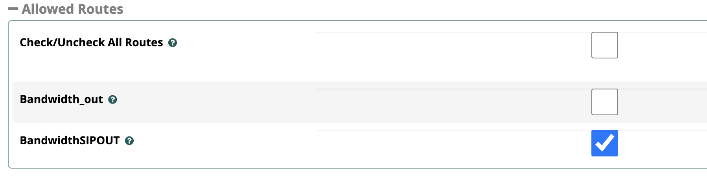

# PBX Interconnect

This document describes configuring interop between a PBX and Bandwidth's Programmable Voice Services.



## Step 1 - Application Configuration

- **Create an application in Bandwidth Dashboard**
    1. Using a browser, surf to dashboard.bandwidth.com and ssign in using your account credentials.
    2. Click the Applications tab.
    3. Click "Create New" in the left navigation panel.
    4. Using the form in the right panel, give your application a name, select "Voice" application type and set the callback URLs to POST and supply URLs to your custom code. For testing you can use the readback service URL: ```https://del4sux0d4.execute-api.us-east-1.amazonaws.com/Prod/``` 
    5. Save your changes.

Your application should look something like this:



Notes:
* You may also create applications programmatically using [APIs](https://dev.bandwidth.com/docs/account/applications)

* You do not need to associate a location or numbers to this application.

Now that your application is created, the next step is to create SIP Credentials and associate them with your application.

## Step 2 - SIP Credentials
- **Create SIP Credentials and associate your application**
    1. Using dashboard.bandwidth.com, click on the Account tab in the top right name menu.
    2. Click the SIP Credentials tab.  If you do not see this tab, SIP Credentials may need to be activated for your account.
    3. Click the Add button in the Manage Realms section to add a realm. _(A realm is a namespace that can be used as a URI pointing to SIP services for registering devices or proxying SIP events to application events.  We are going to use the proxy feature of this service to deliver events to your custom code through the application you set up in step 1.)_
    4.  Provide a name and description, then click Add to create the realm.
    5.  Once your realm has been created you can then click the Add button in the SIP Credentials section.
    6.  Use the SIP Credentials form to enter a username, a password, and to select a realm and an application.  _(Use the realm and application created in the previous steps)_
    7.  Click the Add SIP Credentials button to add the credentials to the SIP Credenitals list.
    8.  Make note of your username, password, and realm as you will need these to set up a trunk from your PBX to the realm.


_Detailed documentation on SIP Credentials can be found_ [here](https://dev.bandwidth.com/docs/account/sipRegistrar).

## Step 3 - PBX Configuration

_NOTE: All PBX software should support trunking, outbound routes, and extensions.  This documentation uses FreePBX as an example, but the concepts should be the same or similar on other PBX implementations._

- **Using the SIP Credentials, create a trunk, outbound route, and extension on your PBX**
  1. Add a trunk to your PBX that points to the realm you created in Step 2.  Provide the username and password you created as auth information. NOTE: __Turn registration off for the trunk.  We want to authenticate outbound, but not register!__ 
  2. Add an outbound route to your PBX that uses the trunk pointing to your realm. 
  3. Add an extension (or use an existing one) and configure to use the outbound route. 

## Test the Configuration

At this point you should be able to place a call from a device registered to your PBX that is using the outbound route configured in step 3.2 and get callbacks sent to your application on the URLs you provided during Step 1.  The webhooks are described in detail [here](https://dev.bandwidth.com/docs/voice/webhooks)

You can also place a programmatic call to the device registered to your PBX.  To do this, initial a call using the calls API:

``` https://voice.bandwidth.com/api/v2/accounts/<Your Account ID>/calls ```

With a request body like this:

```
{
"from": "<Your From Number>",
"to": "sip:user@domain",
"callTimeout": 6,
"answerUrl": "<Your Application Url>",
"applicationId": "<Your Application Id>"
}
```

## Troubleshooting
* If you are not getting callbacks, check your PBX log files to make sure the trunk is reachable.
* Make sure CIDs and formatting are set appropriately.
* Double check URLs configured in the application step are actively listening for and accepting requests.
* Make sure firewall rules are in place to allow traffic to reach the realm.
